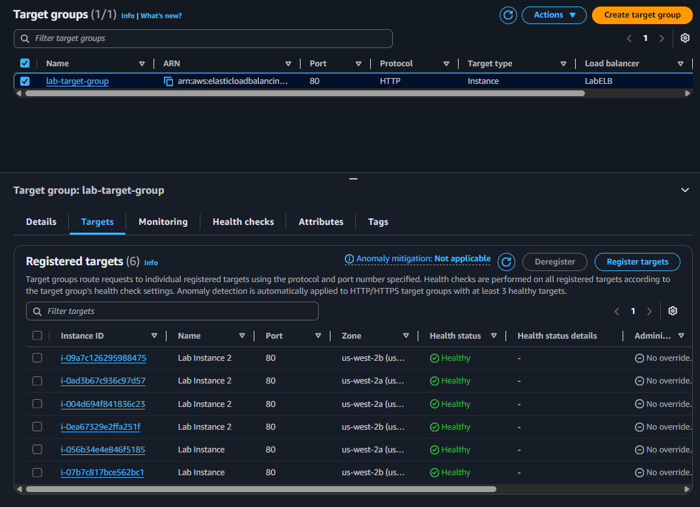
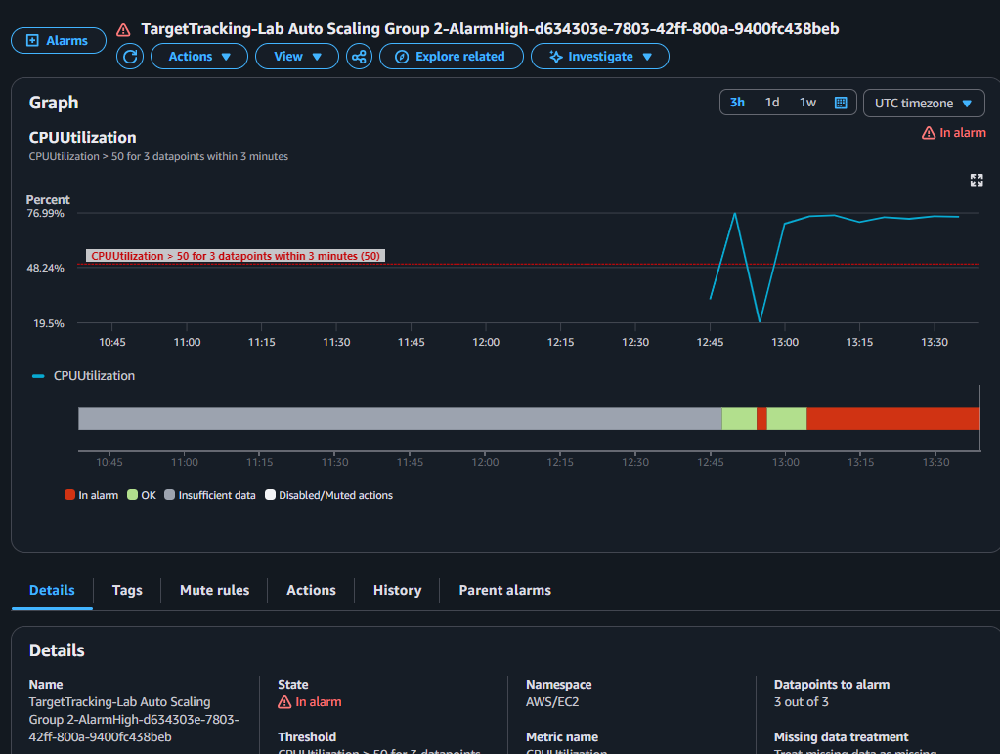
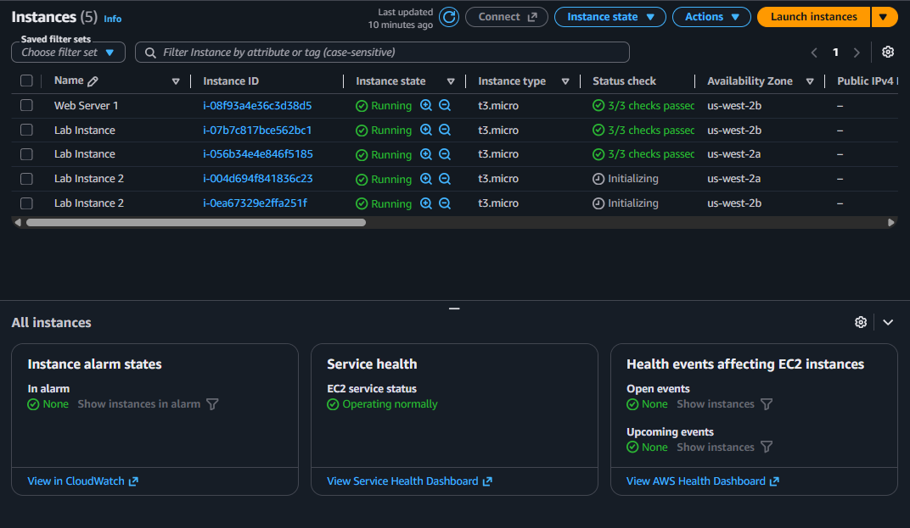

# 🚀 AWS EC2 Auto Scaling & Application Load Balancer Architecture

Este repositório contém o projeto prático de implementação de uma arquitetura resiliente, de alta disponibilidade e autoescalável na AWS utilizando **Application Load Balancer (ALB)**, **EC2 Auto Scaling Groups (ASG)** e alarmes do **Amazon CloudWatch**.

---

## 📌 Visão Geral da Arquitetura

O objetivo final deste projeto é garantir tolerância a falhas e escalabilidade horizontal automática em resposta ao aumento de tráfego/processamento:

* **Subredes Públicas:** Hospedam o Application Load Balancer (ALB) para receber e distribuir o tráfego externo.
* **Subredes Privadas:** Hospedam as instâncias EC2 da aplicação de forma isolada e segura.
* **Auto Scaling Group:** Mantém o tamanho mínimo de 2 instâncias e escala até 4 instâncias com base na utilização média de CPU (alvo de 50%).
* **Health Checks:** Integração entre ALB e ASG para substituir automaticamente instâncias com falha.

---

## 🛠️ Tecnologias e Serviços Utilizados

* **Amazon EC2 & AMIs:** Criação de imagem personalizada a partir de um servidor base web.
* **Application Load Balancer (ALB):** Balanceamento de carga HTTP em múltiplas Zonas de Disponibilidade (AZs).
* **Target Groups:** Agrupamento lógico e monitoramento de saúde (*Health Status*) das instâncias.
* **Launch Template:** Padronização das configurações de inicialização das instâncias EC2.
* **EC2 Auto Scaling Group (ASG):** Regras dinâmicas de escala baseadas em métricas.
* **Amazon CloudWatch:** Monitoramento e gatilhos de alarme de métricas de CPU (`AlarmHigh` e `AlarmLow`).

---

## 📊 Resultados e Validação Prática

### 1. Balanceamento de Carga e Saúdes dos Alvos (Healthy)
Após a criação do ASG e registro das instâncias no *Target Group*, o ALB confirmou a integridade das instâncias em subredes privadas.

### 2. Disparo de Alarme no CloudWatch (Estresse de CPU)
Durante a simulação de carga de processamento na aplicação web, a utilização média de CPU ultrapassou o limite de 50%, alterando o estado do alarme para **In alarm**.

### 3. Escalabilidade Horizontal Automática (Scale-out)
Em resposta ao alarme acionado pelo CloudWatch, o Auto Scaling Group iniciou automaticamente novas instâncias para absorver a demanda extra.

---

## 🧠 Aprendizados Chave

* Separação de camadas da arquitetura (pública vs. privada) seguindo boas práticas de segurança na AWS.
* Configuração de métricas de rastreamento de metas (*Target Tracking Scaling Policy*).
* Entendimento prático de resiliência e alta disponibilidade infraestrutural sob estresse de tráfego.
